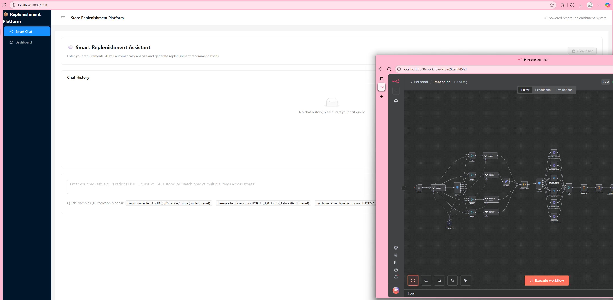
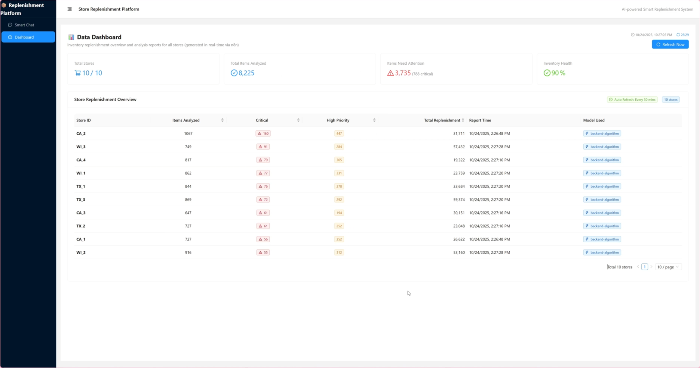

## SECTION 1 : PROJECT TITLE
## Store Replenishment Platform

---

## SECTION 2 : EXECUTIVE SUMMARY / PAPER ABSTRACT
Many retail stores still rely on experience and simple reports to make replenishment decisions:
•	Demand fluctuations and seasonality often result in alternating periods of stockouts and overstocking.
•	Available data is usually limited to sales, prices, and inventory snapshots, lacking end-to-end visibility of warehouse, geographic, transportation, and cost information.
•	Manual judgment struggles to balance replenishment schedules and safety stock for a future window of T days, often missing holiday effects or promotional impacts.

This project presents a prototype intelligent replenishment system that we have developed to assist store managers in making data-driven restocking decisions.
The front-end interface allows managers to view replenishment recommendations for upcoming time periods.
The system integrates historical sales and price data from the same store and comparable regions, together with current inventory levels, to produce an optimized replenishment list and recommended quantities for the next T days (configurable).
To ensure interpretability and automation, the system combines Chain-of-Thought (CoT) reasoning, n8n workflow orchestration, and Model Context Protocol (MCP) for external API integration.

---

## SECTION 3 : CREDITS / PROJECT CONTRIBUTION

| Official Full Name  | Student ID (MTech Applicable)  | Work Items (Who Did What) | Email (Optional) |
| :------------ |:---------------:| :-----| :-----|
| Liu Zheyi | A0298521X | Data Preparation, Database setup, Data analyze and setup backend structure | e1352659@u.nus.edu |
| Cen Haoyang | A0297892A | Config and setup of COT Reasoning Chain, integrating different part into one single n8n workflow, contribute to dashboard connection with n8n | e1352030@u.nus.edu |
| Gao Zijie | A0295363W | Contributed to developing the AI reasoning workflow in n8n, integrating Webhooks, backend APIs, and an LLM-based Chain-of-Thought (COT) reasoning module. Helped automate data extraction, validation, forecasting, and reasoning fusion, enabling interpretable AI-driven decision outputs. Developed the Chat Page and Dashboard Page in React, integrating real-time reasoning results with interactive visual insights.| e1349501@u.nus.edu |
| Lian Da | A0295323A | Inventory prediction, help on the n8n workflow config | e1349461@u.nus.edu |
| Wu Hongjia | A0297459E |  Designed and implemented the forecasting intelligence layer; developed FastAPI microservice for MA14, ARIMA, Prophet, and LSTM models; engineered holiday and price-promotion features; exposed forecasting APIs to reasoning and n8n workflow modules. | e1351597@u.nus.edu |

---

## SECTION 4 : VIDEO OF SYSTEM MODELLING & USE CASE DEMO

---

## SECTION 5 : USER GUIDE

### Installation Guide

**Prerequisites**
- PostgreSQL database server with a user that can create schemas and tables.
- Docker Desktop; Windows users should enable WSL for the best container compatibility.
- Ollama installed locally with the language models you plan to serve (for example `ollama pull llama3`).
- Node.js 18+ and Python 3.10+ available on your PATH.

**Backend Preparation**
1. Download the M5 forecasting dataset (Kaggle) and place the CSV files inside `SystemCode/Backend/StoreBackend/m5-forecasting-accuracy/`.
2. From `SystemCode/Backend/StoreBackend/`, run `python m5.py` to create and seed the PostgreSQL database.
3. Create and activate a Python virtual environment, then install backend dependencies with `pip install -r requirements.txt`.
4. Update the database connection strings in both `.env` and `app/core/settings.py` so they point to your PostgreSQL instance.

**Run the Backend API**
1. Ensure PostgreSQL is running and reachable with the credentials configured above.
2. From `SystemCode/Backend/StoreBackend/`, start the FastAPI service with `python run_api.py`.
3. Confirm the API is reachable at the configured host and port (default `http://127.0.0.1:8000`).

**Run the Frontend**
1. Change to `SystemCode/Frontend/StoreFrontend/` and install dependencies with `npm install`.
2. Launch the Vite development server using `./start.sh` (macOS/Linux/WSL) or `start.bat` (Windows PowerShell).
3. Open the printed URL in your browser to access the web interface.

**Configure n8n Orchestration**
1. Install the official Docker version of n8n following the documentation at https://docs.n8n.io/hosting/installation/docker/ and start the container.
2. Import both workflow JSON files located in `SystemCode/Frontend/StoreFrontend/n8n/` via the n8n editor UI.
3. Update each workflow to use the correct webhook URLs for your backend endpoints and set both workflows to **Active**.
4. Add the PostgreSQL database credentials and your LLM API key (for the Ollama bridge) to the corresponding n8n credentials.
5. Test each workflow manually to verify that database access, webhook calls, and LLM responses succeed.

---
## SECTION 6 : PROJECT REPORT / PAPER

`Refer to project report at Github Folder: ProjectReport`

---
## SECTION 7 : MISCELLANEOUS

`Refer to Github Folder: Miscellaneous`

---

